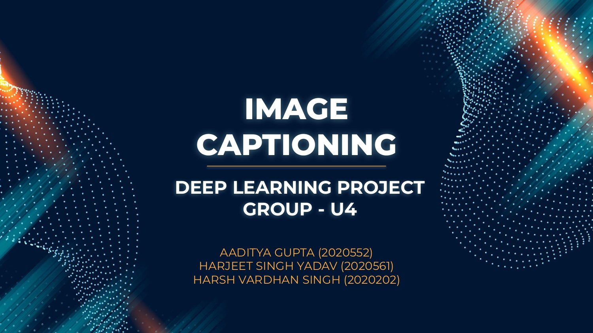
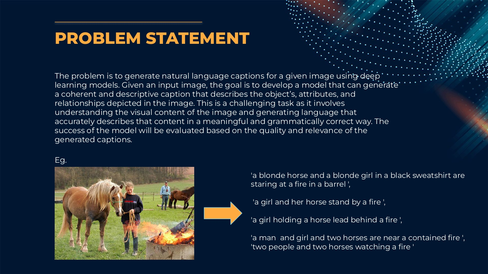
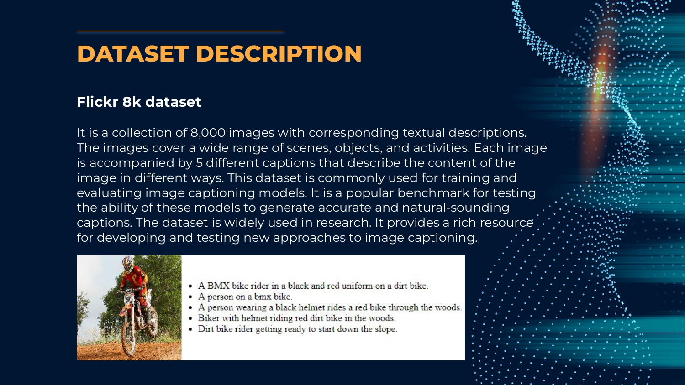
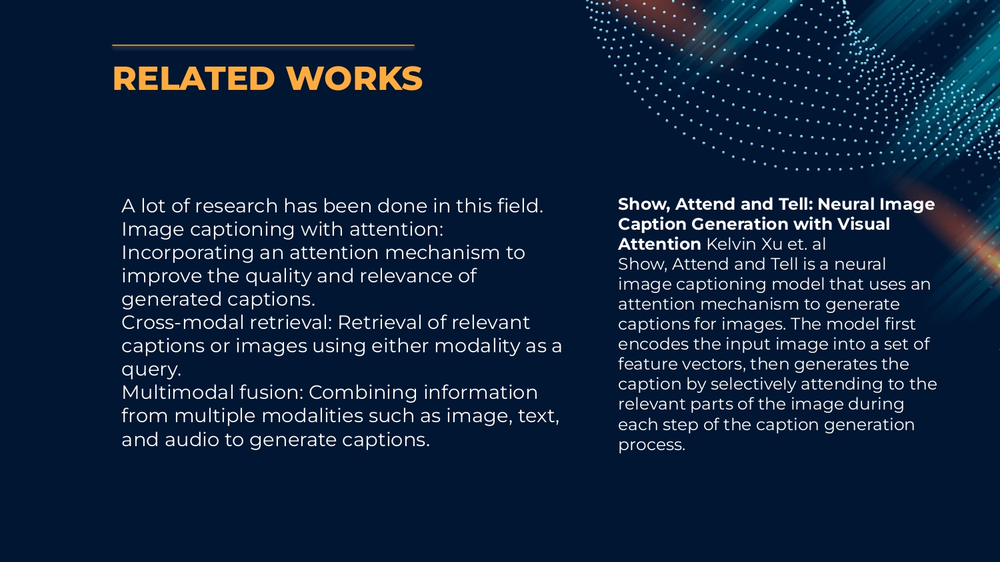
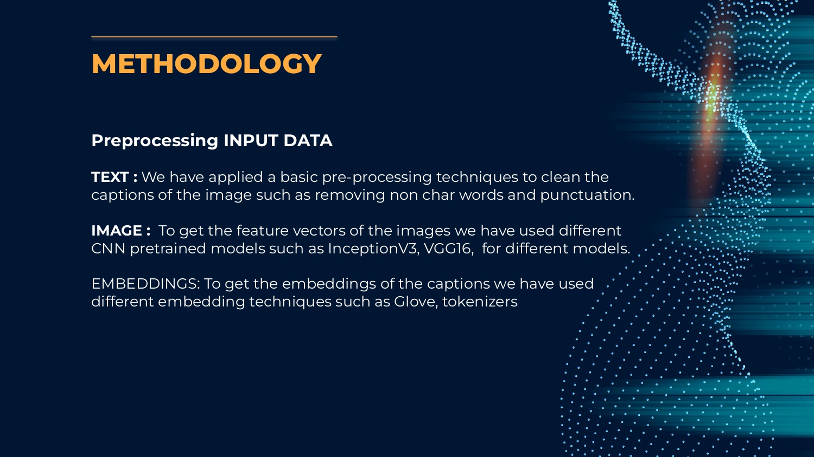
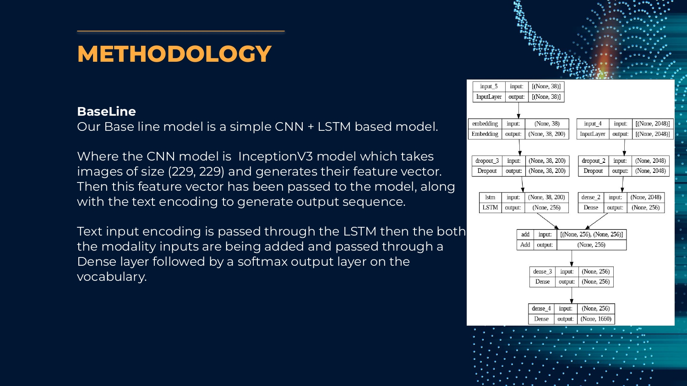
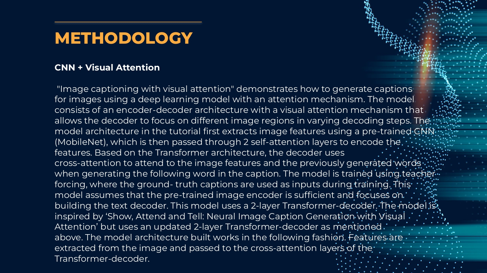
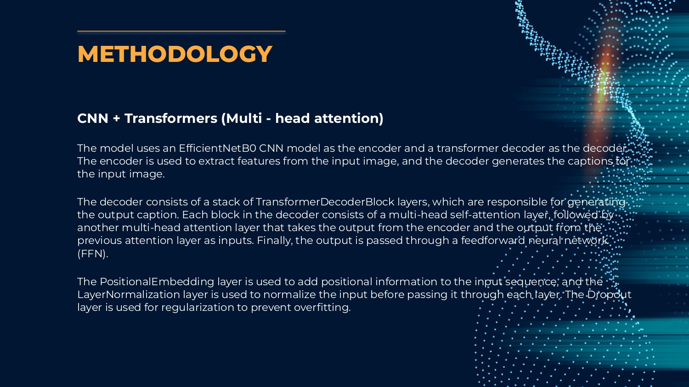
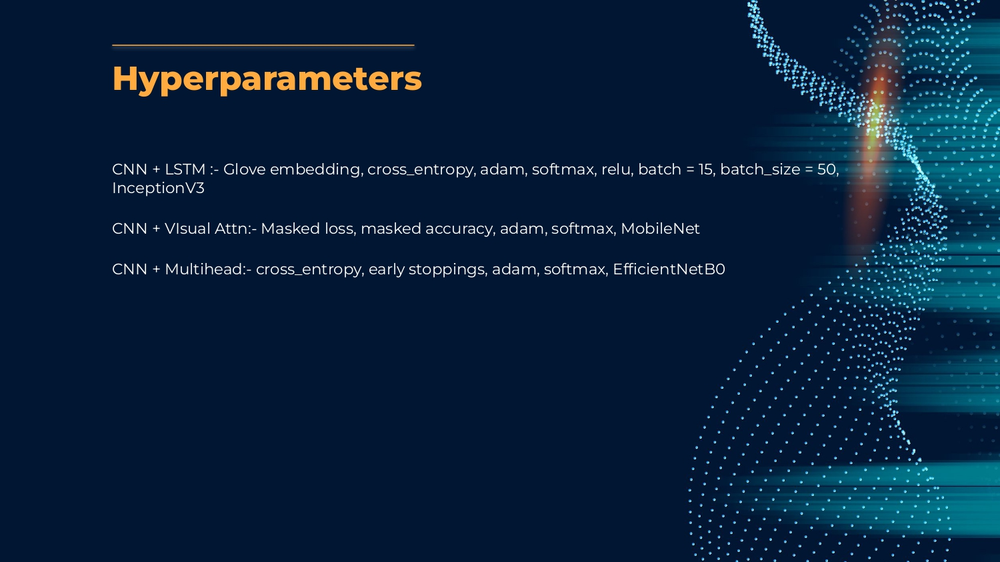

# Image-captioning-model
Given a image, generate caption describing the image

Image captioning is the process of generating a textual description of an image. It is an interdisciplinary field that combines computer vision and natural language processing. In an image captioning model, a deep neural network is trained to automatically generate captions for images.

The Flickr8k dataset is a popular benchmark dataset for image captioning, containing 8,000 images that have been annotated with 5 captions each. The dataset is widely used for training and evaluating image captioning models. Each image in the dataset is accompanied by 5 different captions, providing a variety of descriptions for each image. The dataset is suitable for evaluating models that generate single captions or multiple captions for an image.

